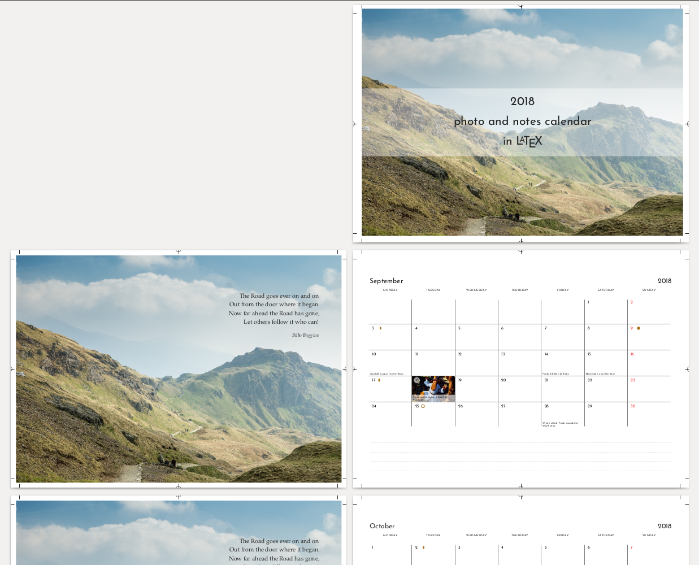
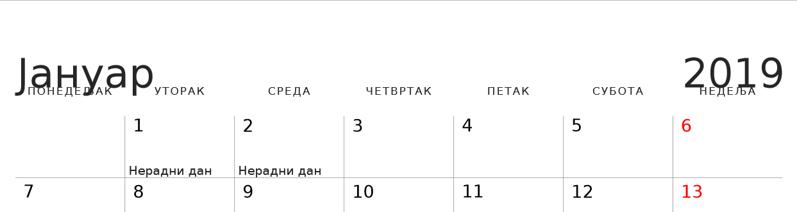

# Frequently Asked Questions

<!-- markdown-toc start - Don't edit this section. Run M-x markdown-toc-refresh-toc -->
**Table of Contents**

- [Frequently Asked Questions](#frequently-asked-questions)
    - [How to use the wallcalendar package on Overleaf.com?](#how-to-use-the-wallcalendar-package-on-overleafcom)
    - [How to crop photos?](#how-to-crop-photos)
    - [What is the recommended pixel resolution for the photos?](#what-is-the-recommended-pixel-resolution-for-the-photos)
    - [How to create only calendar pages, with no photos?](#how-to-create-only-calendar-pages-with-no-photos)
    - [How to print on a home office printer?](#how-to-print-on-a-home-office-printer)
    - [How to add the lines of the outer frame of the calendar grid?](#how-to-add-the-lines-of-the-outer-frame-of-the-calendar-grid)
    - [How to insert a normal text page?](#how-to-insert-a-normal-text-page)
    - [How to change the margins and page layout on specific pages?](#how-to-change-the-margins-and-page-layout-on-specific-pages)
    - [How to use other alphabets such as Cyrillic?](#how-to-use-other-alphabets-such-as-cyrillic)
    - [How to customize the fonts and point sizes?](#how-to-customize-the-fonts-and-point-sizes)
    - [How to position the month and year label?](#how-to-position-the-month-and-year-label)
    - [How to position the photo differently?](#how-to-position-the-photo-differently)
    - [How to format or decorate special days?](#how-to-format-or-decorate-special-days)
    - [How to add or customize the calendar drawing style?](#how-to-add-or-customize-the-calendar-drawing-style)
    - [How to remove the notepad lines?](#how-to-remove-the-notepad-lines)

<!-- markdown-toc end -->

## How to use the wallcalendar package on Overleaf.com?

Set the compiler to `LuaLaTeX` in the project settings sidebar.

Example using Photo and Notes layout, `wallcalendar v1.4`:

- [Project](https://www.overleaf.com/read/hzjpfdmspwds)
- [Github repo](https://github.com/profound-labs/wallcalendar-photo-and-notes-overleaf)

Example using single page layouts, `wallcalendar v1.4`:

- [Project](https://www.overleaf.com/read/kjpcxcsmxkjc)
- [Github repo](https://github.com/profound-labs/wallcalendar-portrait-layouts-overleaf)

The one listed in the template gallery is using `wallcalendar v1.3`:

- [Project](https://www.overleaf.com/read/yyvqfsbsmssm)
- [Template](https://www.overleaf.com/latex/templates/wall-calendar/yyvqfsbsmssm)

## How to crop photos?

Photos have to be cropped to the aspect ratio of their intended size. If they
are going to be full page, then the aspect of the page dimensions.

|           | Width    | Height   | Width    | Height  |   Aspect |
|-----------|----------|----------|----------|---------|----------|
| A4        | 297.0 mm | 210.0 mm | 11.69 in | 8.27 in | 1:1.4142 |
| US Letter | 279.4 mm | 215.9 mm | 11.0 in  | 8.5 in  | 1:1.2941 |
| US Legal  | 355.6 mm | 215.9 mm | 14.0 in  | 8.5 In  | 1:1.6470 |

I tend to crop them manually. I open the image in GIMP, and start with adding guides on the edges:

- Select All (Ctrl + A)
- Image > Guides > New Guides from Selection

Then to crop:

- select the **Rectangle Select** tool
- set `Fixed aspect ratio`

It takes integers, so you can use the inch numbers (11x8.5) multiplied up:
110:85. Then select the area and crop.

## What is the recommended pixel resolution for the photos?

For a good quality print, 300dpi (dot-per-inch) is recommended.

If it is a full-page photo, take the size of the page in inches, and multiply by 300.

For US Letter:

```
11 inch * 300 = 3300 pixel
8.5 inch * 300 = 2550 pixel
```

## How to create only calendar pages, with no photos?

Use the `disabled = true` option:

```
\SetPhoto[disabled = true]{October}
```

This can be used to produce calendar-only pages. Example:

- [cal-no-photos.tex](./doc/examples/cal-no-photos.tex)
- [cal-no-photos.pdf](./doc/examples/cal-no-photos.pdf)

In addition this allows you to implement the photo or other display-piece pages
as regular content between the months.

```
\clearpage

(... nice things to look at in October ...)

\MonthPage[layout=photo and notes]{October}

\clearpage

(... nice things to look at in November ...)

\MonthPage[layout=photo and notes]{November}
```

## How to print on a home office printer?

Calendars can be easily printed on a home office printer, an inkjet on thicker
(120-150gsm) glossy paper can produce nice results.

But you also have to trim and bind, so taking the PDF (with cropmarks, using the
`showtrims` option) to a printing shop might be better.

The portrait layouts, designed for one-sided printing are straightforward.

The photo and notes layout is designed for two-sided printing.

The first page have to be a title page (or empty) so that the following pages
are photo and notes as facing pages. The facing photo and note pages don't have
to be rotated.

If the printer can do two-sided print (also called duplex print) then select
`Duplex over long edge`. Or else the pages have to be turned manually in which
case it will depend on the machine.

Trimming with bleed cut:

The effective calendar size has to be smaller than the paper size, because you
want to cut the photo pages such that the edge of the photo extends `~3mm` over
the margin (called bleeded image cut), and so the bleed space and trim marks
also have to fit on the sheet.

With some `trimSpace` the `showtrims` option enabled:

```
\documentclass[
  year = 2018,
  language = english,
  eventsCsv = ./data/holidays.csv,
  markDefaultsCsv = ./data/mark_defaults.csv,
  imageFolder = ./photos/,
  paperWidth = 11in - 15mm,
  paperHeight = 8.5in - 15mm,
  trimSpace = 15mm,
  topMargin = 15mm,
  showtrims,
]{wallcalendar}
```



## How to add the lines of the outer frame of the calendar grid?

That is, so that each day appears as a box.

This can be turned on with a class option: `gridSurround`.

The following example demonstrates this:

- [cal-no-photos.tex](./doc/examples/cal-no-photos.tex)
- [cal-no-photos.pdf](./doc/examples/cal-no-photos.pdf)

## How to insert a normal text page?

Further content can be added to document body as regular LaTeX.

The `\MonthPage` commands produce one or two pages, but content can be added
before or after them as normal.

You might want to customize the margins on those pages, see the next question.

## How to change the margins and page layout on specific pages?

It is possible to change the page layout mid-document. The `wallcalendar` builds
on the `memoir` documentclass, so you have to use memoir's layout mechanisms.

Refer to memoir's documentation, chapter `Laying out the page`.

Note that you will have to work around this bug:

[Changing textblock and margin size mid-document with memoir](https://tex.stackexchange.com/questions/110201/changing-textblock-and-margin-size-mid-document-with-memoir)

For example, define a command in the preamble such as

```
\newcommand{\newMargins}{%
  \makeatletter%
  \settypeblocksize{172mm}{96mm}{*}%
  \setlrmargins{*}{25mm}{*}%
  \checkandfixthelayout%
  \ch@ngetext%
  \makeatother%
}
```

Then in the document body:

```
\clearpage
\newMargins

Lorem ipsum dolor sit amet...
```

The additional page layout commands will be changing the existing settings.
`wallcalendar` sets up the page layout so:

```
\ifshowtrims
  \setstocksize{\calPaperHeight + \@wall@trimSpace}{\calPaperWidth + \@wall@trimSpace}
  \setlength{\paperheight}{\calPaperHeight}
  \setlength{\paperwidth}{\calPaperWidth}
  \trimXmarks
  \trimLmarks
  \quarkmarks
  \settrims{0.5\stockheight - 0.5\paperheight}{0.5\stockwidth - 0.5\paperwidth}
  \settrimmedsize{\calPaperHeight}{\calPaperWidth}{*}
\else\relax
  \setstocksize{\calPaperHeight}{\calPaperWidth}
  \settrims{0pt}{0pt}
  \settrimmedsize{\stockheight}{\stockwidth}{*}
\fi

\setlrmarginsandblock{\@wall@leftMargin}{\@wall@rightMargin}{*}
\setulmarginsandblock{\@wall@topMargin}{\@wall@bottomMargin}{*}
\setheadfoot{0pt}{0pt}
\setheaderspaces{0pt}{*}{*}

\checkandfixthelayout% This will typeout values in pt.
\settypeoutlayoutunit{mm}% It is useful to see layout values in mm too.
\typeoutlayout
```

## How to use other alphabets such as Cyrillic?

Use a font which includes the characters of the alphabet.

For Cyrillic for example, the DejaVu font implements the characters. This font
is available on many systems by default, so you can load it with `fontspec` by
name.

If you want to use a custom font, add it to the project folder and load it with
path and file name as below.

```
\usepackage{fontspec}
\defaultfontfeatures{Ligatures={TeX}}

\newfontfamily\dejaVuSans{DejaVu Sans}

\newfontfamily\josefinSans[Path = {./fonts/}]{JosefinSans-Regular.ttf}
```

Then insert the command in the formatting macros of the layout.

For example the `photo and notes` layouts expects formatting hooks in `\photoAndNotesFmt`.

```
\renewcommand\photoAndNotesFmt{%
  \renewcommand*\monthFmt{\josefinSans\LARGE}%
  \renewcommand*\yearFmt{\josefinSans\LARGE}%
  % ... copy the unmodified hooks as well (omitting here)
}
```

## How to customize the fonts and point sizes?

Each layout has a command where the formatting hooks can be redefined,
resembling the layout name.

For the `full page` layout, there is `\fullPageFmt`.

Each month page starts with resetting the formatting hooks. Then the formatting
command is called, where the hooks can be redefined.

It is not enough to renew `\monthFmt`, it has to be renewed in `\fullPageFmt`.

So in your document preamble, you would add:

```
\renewcommand\fullPageFmt{%
  \renewcommand*\monthFmt{\LARGE}%
  \renewcommand*\yearFmt{\LARGE}%
  \renewcommand*\dayLetterColor{}%
  \renewcommand*\dayLetterFmt{\tiny}%
  \renewcommand*\dayTextFmt{\small}%
  \renewcommand*\quoteFmt{}%
  \renewcommand*\headingFmt{\centering}%
  \renewcommand*\calendarFmt{\centering}%
  \renewcommand*\eventsFmt{\setlength{\parindent}{0pt}\raggedleft\footnotesize}%
}
```

## How to position the month and year label?

Sometimes the heading text can overlap with the calendar grid, or other tricky
positioning can be out of place.



I recommend cloning the `wallcalendar` package repository for each new project,
and fixing these adjustments directly in the class file.

In this case find the `tikzpicture` drawing the calendar within the layout you
are using, and change the positioning values directly.

Like below, either adjust the '10pt' of the heading, or lower down, the '35pt'
of the calendar.

```
\node (heading) [
  below right=10pt and {\@t@rightOffset} of bg.north west,
  anchor=north west,
]

% ...

\node (calendar) [
  below right=35pt and {\@t@rightOffset} of bg.north west,
  anchor=north west,
]
```

## How to position the photo differently?

Custom photo handler macros are easy to add. Define it in the preamble:

```
\pgfkeys{
  /put photo/.is family, /put photo,
  half size centered/.code = {%
    \def\@wall@photo@putPhoto##1{%
      \begin{minipage}[t][\calPaperHeight][b]{\calPaperWidth}%
        \centering
        \mbox{}\vfill
        
        \includegraphics[width=0.5\linewidth]{##1}%

        \vfill\mbox{}%
      \end{minipage}%
    }%
    \def\@wall@photo@setYOffset{}%
  },
}
```

And then specify it in the document body:

```
\MonthPage[layout=photo and notes, put photo=half size centered]{September}
```

## How to format or decorate special days?

This includes changing the colour, adding footnote-style asterisks or marks and
other decoration.

**Sunday colour**

```
\colorlet{sunday}{blue}
```

**Specific date**

Using date expressions:

```
\SetEvents{June}{%
  if (equals=2018-06-21)
    [day text={\dejaVuSans\char"263C}];% U+263C white sun with rays
}{%
\raggedleft
{\dejaVuSans\char"263C} June 21: Summer Solstice
}
```

Adding decorations as tikz nodes:

```
\SetEvents{September}{%
\semicolonEndTikzCalendar%
% adding marks
\node (bluecircle) [
  below right=0.3pt and 0.1pt of cal09-2018-09-18-daynumber.center,
  anchor=center,
  circle,
  minimum width=15pt,
  inner sep=0pt,
  fill=blue,
  opacity=0.6,
] {};%
% repeat the day number (the filled circle covers it)
\calDayNumberNode{cal09-2018-09-18}{-redo}{\dayTextFmt 18}%
%
% Optionally, inline print the day's event text if a csv was loaded with
% eventsCsv class option.
%\parseMonthInlineNotes%
}{}
```

**Recurring dates**

For recurring dates (every Monday, every first week of the month, etc.), date
expressions can be used with the syntax above.

See the `pgfmanual` on how to define date conditions. A specific example it provides:

```
% Workers day (May 1st)
\pgfkeys{/pgf/calendar/workers day/.code=%
{
  \ifnum\pgfcalendarifdatemonth=5\relax
    \ifnum\pgfcalendarifdateday=1\relax
      \pgfcalendarmatchestrue
    \fi
  \fi
}}
```

## How to add or customize the calendar drawing style?

Look at `wallcalendar.cls` and find which calendar style is used in the layout
you are using. For the `full page` layout we find the following, indicating the
`alnitak` calendar style.

```
\newcommand*{\tikzMonthCalendar@fullpage}[1]{%
\pgfkeys{/Events/\monthName{#1}/marks/.get=\@eventmarks}%
\calendar (cal#1) [alnitak, dates=\CalendarYear-#1-01 to \CalendarYear-#1-last] \@eventmarks;%
}
```

Then copy `alnitak` and redefine it in your preamble, or renew the above command
to use a calendar style which you have created elsewhere.

```
\tikzstyle{alnitak}=[
  day list right,
  day xshift={0pt},
  every month/.append style={anchor=base, inner xsep=0pt, yshift=4mm, xshift=-\widthof{\space}},
  day text={\dayTextFmt\%d-},
  every day/.append style={anchor=base, inner xsep=0pt},
  execute before day scope={
    %
    % === Moving the day number ===
    %
    % A small offset seems to improve the result, the last day gets closer to the end of the linewidth
    \pgftransformxshift{0.01em}
    \pgfcalendarjuliantodate{\pgfcalendarendjulian}{\currentyear}{\currentmonth}{\lastday}
    % Width of month day digits from 1 - 28
    \setlength{\@tmp@a}{\widthof{12345678910111213141516171819202122232425262728}}
    \setlength{\@tmp@b}{\widthof{30}}
    \pgfmathparse{(\linewidth - \@tmp@a - \@tmp@b * (\lastday-28)) / \lastday}
    \pgftransformxshift{\pgfmathresult}
    \let\%=\pgfcalendarshorthand
    \setlength{\@tmp@a}{\widthof{\%d-}}
    \pgftransformxshift{\@tmp@a}
    %
    % === Weekday letter above the day ===
    %
    \ifdate{weekend}{\def\dayLetterColor{\color{weekend}}}{\def\dayLetterColor{\color{weekday}}}%
    \node[anchor=base,yshift=5.5mm,inner sep=0pt]{%
      \dayLetterColor\dayLetterFmt\@tr@dayLetter{\pgfcalendarcurrentweekday}%
    };%
  },
]
```

## How to remove the notepad lines?

```
\renewcommand\photoAndNotesFmt{%
  % ...
  \renewcommand\notepadContent{}%
  % ...
}
```

