# Wallcalendar LaTeX documentclass

A wall calendar class with custom layouts and support for internationalization.

<!-- markdown-toc start - Don't edit this section. Run M-x markdown-toc-refresh-toc -->
**Table of Contents**

- [Wallcalendar LaTeX documentclass](#wallcalendar-latex-documentclass)
    - [Features](#features)
    - [Installing](#installing)
        - [TeXLive](#texlive)
        - [Using from a git clone](#using-from-a-git-clone)
        - [As a local package](#as-a-local-package)
    - [Overleaf examples](#overleaf-examples)
    - [Frequently Asked Questions](#frequently-asked-questions)
    - [Back matter](#back-matter)

<!-- markdown-toc end -->

## Features

The documentclass comes with the following layouts:

- Full page photo, the calendar days overlaid with opacity
- Full page photo, the photo above the calendar days
- Small landscape photo, with a calendar grid
- Photo and Notes, photo and calendar on separate pages to allow space for note taking
- Title page
- Year planner
- Thumbnails and captions
- Varnish mask

There is also support for loading event marks from a CSV file.

See `wallcalendar.pdf` for the user manual, and `wallcalendar-code.pdf` for the
commented code documentation.

The manual includes examples and tutorials, but you may also want to see the [doc/examples][examples] folder on Github.

[examples]: https://github.com/profound-labs/wallcalendar/tree/master/doc/examples

## Examples

Files are in the [doc/examples](https://github.com/profound-labs/wallcalendar/tree/master/doc/examples) folder.

### Load custom event footnotes from CSV

[cal-marks.tex](doc/examples/cal-marks.tex) | [cal-marks.pdf](doc/examples/cal-marks.pdf)


### Portrait page

[cal-plain.tex](doc/examples/cal-plain.tex) | [cal-plain.pdf](doc/examples/cal-plain.pdf)

#### Full page photo, calendar days overlaid with opacity

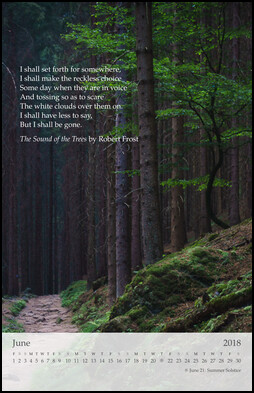

#### Full page photo, photo above the calendar days

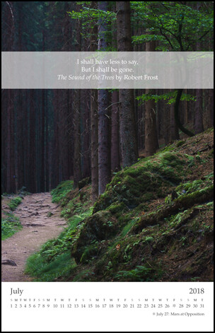

#### Small landscape photo, with a calendar grid

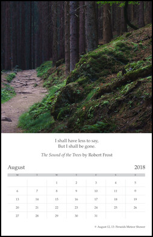

### Landscape photo and notes on two pages

[cal-photo-and-notes.tex](doc/examples/cal-photo-and-notes.tex) | [cal-photo-and-notes.pdf](doc/examples/cal-photo-and-notes.pdf)

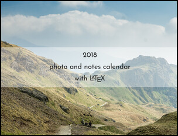


### Year planners

#### Portrait year planner

[cal-year-planner.tex](doc/examples/cal-year-planner.tex) | [cal-year-planner.pdf](doc/examples/cal-year-planner.pdf)

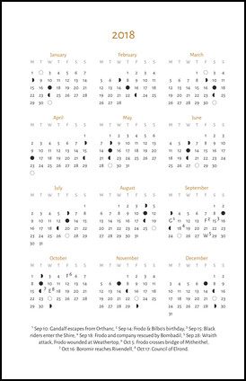

#### Landscape year planner with dates in rows

[cal-year-planner-landscape-rows.tex](doc/examples/cal-year-planner-landscape-rows.tex) | [cal-year-planner-landscape-rows.pdf](doc/examples/cal-year-planner-landscape-rows.pdf)


#### Landscape year planner with grid

[cal-year-planner-landscape-grid.tex](doc/examples/cal-year-planner-landscape-grid.tex) | [cal-year-planner-landscape-grid.pdf](doc/examples/cal-year-planner-landscape-grid.pdf)


#### Compact year planner

[cal-year-planner-compact.tex](doc/examples/cal-year-planner-compact.tex) | [cal-year-planner-compact.pdf](doc/examples/cal-year-planner-compact.pdf)

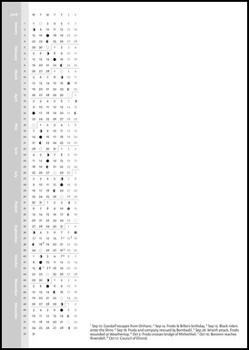

### No photos, with notes area

[cal-no-photos.tex](doc/examples/cal-no-photos.tex) | [cal-no-photos.pdf](doc/examples/cal-no-photos.pdf)

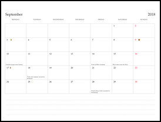

### Showframe

[cal-showframe.tex](doc/examples/cal-showframe.tex) | [cal-showframe.pdf](doc/examples/cal-showframe.pdf)

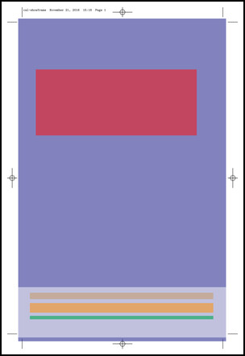

### Showtrims (Cropmarks)

[cal-showtrims.tex](doc/examples/cal-showtrims.tex) | [cal-showtrims.pdf](doc/examples/cal-showtrims.pdf)

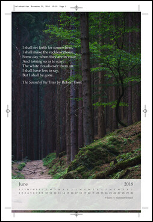

### Varnishmask

[cal-varnishmask.tex](doc/examples/cal-varnishmask.tex) | [cal-varnishmask.pdf](doc/examples/cal-varnishmask.pdf)

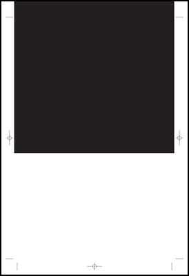

### Thumbnails and captions

[cal-thumbnails.tex](doc/examples/cal-thumbnails.tex) | [cal-thumbnails.pdf](doc/examples/cal-thumbnails.pdf)

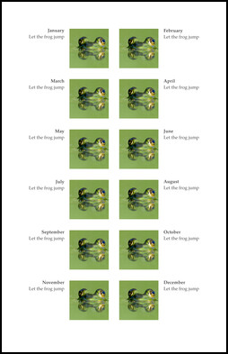

### Translations

cal-translations-english.tex

cal-translations-hungarian.tex

cal-translations-japanese.tex

## Overleaf examples

Set the compiler to `LuaLaTeX` in the project settings sidebar.

Example using Photo and Notes layout, `wallcalendar v1.4`:

- [Project](https://www.overleaf.com/read/hzjpfdmspwds)
- [Github repo](https://github.com/profound-labs/wallcalendar-photo-and-notes-overleaf)

Example using single page layouts, `wallcalendar v1.4`:

- [Project](https://www.overleaf.com/read/kjpcxcsmxkjc)
- [Github repo](https://github.com/profound-labs/wallcalendar-portrait-layouts-overleaf)

## Installing

### TeXLive

TeXLive includes the `wallcalendar` package since 2018.

CTAN link: https://ctan.org/pkg/wallcalendar

### Using from a git clone

I recommend however to clone this repository for each new calendar project, this
way you can make small changes directly in `wallcalendar.cls` or the `lua`
scripts.

You can start with one of the examples and start tweaking it. Optionally, remove
the docs if you don't want to include them in your project.

```
git clone https://github.com/profound-labs/wallcalendar.git

cd wallcalendar
cp doc/examples/cal-photo-and-notes.tex ./new-calendar.tex

cp -r doc/examples/data .
cp -r doc/examples/photos .
cp -r doc/examples/fonts .

rm doc/ -r
rm LICENSE.txt Makefile README.md wallcalendar-code.pdf wallcalendar-layouts.png wallcalendar.pdf

lualatex -interaction=nonstopmode -halt-on-error ./new-calendar.tex
```

### As a local package

If you wanted to install it as a local package, the `make local-install` task in
the project root will try to install it at `$TEXMFHOME/tex`.

## Frequently Asked Questions

See [FAQ](./FAQ.md)

## Back matter

Github: https://github.com/profound-labs/wallcalendar

CTAN: https://ctan.org/pkg/wallcalendar

Contact: Gambhiro Bhikkhu <gambhiro.bhikkhu.85@gmail.com>

LPPL LaTeX Public Project License

