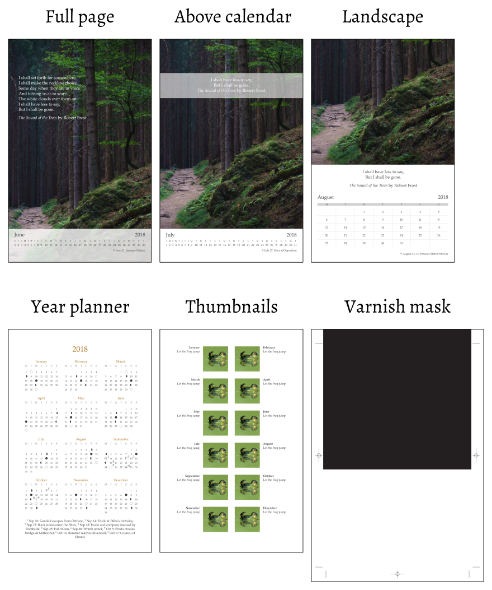

# Wallcalendar LaTeX documentclass

A wall calendar class with custom layouts and support for internationalization.

The documentclass comes with the following layouts:

- Full page photo, the calendar days overlaid with opacity
- Full page photo, the photo above the calendar days
- Small landscape photo, with a calendar grid
- Year planner
- Thumbnails and captions
- Varnish mask

There is also support for loading event marks from a CSV file.

See `wallcalendar.pdf` for the user manual, and `wallcalendar-code.pdf` for the
commented code documentation.

The manual includes examples and tutorials, but you may also want to see the [doc/examples][examples] folder on Github.

Github: https://github.com/profound-labs/wallcalendar

[examples]: https://github.com/profound-labs/wallcalendar/tree/master/doc/examples

Contact: Gambhiro Bhikkhu <gambhiro.bhikkhu.85@gmail.com>

LPPL LaTeX Public Project License
